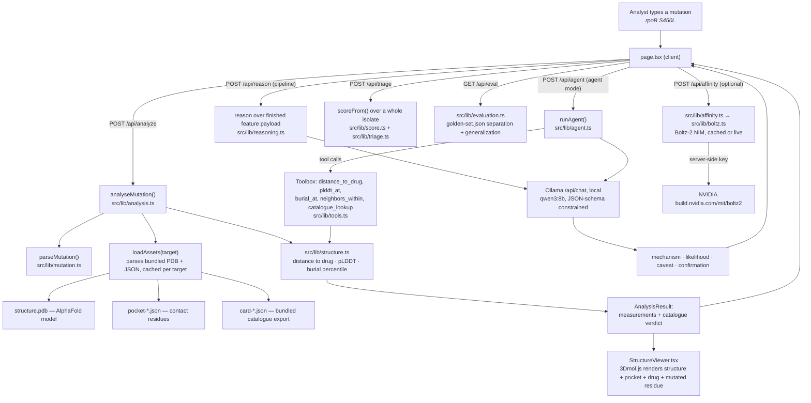

# AMR Resistance Copilot

A structure-grounded mechanistic interpreter for antimicrobial-resistance mutations.

## The problem

Antibiotic resistance kills by out-evolving the drugs we use to treat infection. When a
lab sequences a pathogen and finds a mutation in a drug target gene, the standard next
step is a catalogue lookup: CARD, the WHO tuberculosis mutation catalogue, ResFinder.
These catalogues are lists of mutations someone has already seen, phenotyped and
written up — and they are the right first move, because a catalogue hit carries real
phenotypic evidence. The problem is what happens when the lookup returns nothing.
Genomic surveillance turns up mutations no catalogue has recorded constantly, and a
catalogue has no way to say anything about one of them — not "probably fine," not
"worth a second look," nothing. The analyst is left guessing while a patient's
treatment decision waits. This tool is built for that gap: it reasons from the drug
target's actual 3D structure instead of a list, so it can produce a mechanistic,
checkable hypothesis for a mutation no database recognizes, and it says explicitly what
a catalogue-only workflow would have returned for the same input. Where a catalogue
does have phenotypic evidence, that evidence still wins — the claim here is only ever
about the mutations a catalogue is silent on.

**Flagship case:** *M. tuberculosis* rpoB S450L — the textbook rifampicin-resistance
mutation, sitting in RNA polymerase's rifampicin-binding pocket. Three targets ship in
total (see below), selectable at runtime.

## System design

### How a request actually flows



Two things make this diagram worth reading rather than skipping. First, **the pipeline
and the agent measure the same structure through the same functions** —
`src/lib/tools.ts` is a thin wrapper over `src/lib/structure.ts`, not a second
implementation, so the two reasoning paths cannot quietly drift apart. Second, **the
model never sees the catalogue verdict** in the pipeline path — `AnalysisResult`
carries it, the UI renders it, but the payload built for Ollama in `reasoning.ts`
withholds it deliberately, so a hypothesis about a famous mutation can't just be
recited from training data.

### Full repo layout

```
AMR_Resistance_Copilot/
├── README.md                        this file
├── PLAN.md                          where the project is headed next
├── package.json                     Next.js 16 / React 19 / Tailwind 4
│
├── public/
│   ├── hero.pdb                     AlphaFold model of rpoB (P9WGY9), the hero structure
│   └── data/
│       ├── structures/              gyrA.pdb, inhA.pdb — AlphaFold models, the other two targets
│       ├── pocket-*.json            drug-contact residues, measured from a real bound complex
│       ├── *-pose.pdb               the crystallographic ligand, superposed onto the AlphaFold model
│       ├── card-*.json              bundled CARD catalogue export, one file per target
│       ├── golden-set.json          hand-labelled eval set (rpoB only)
│       └── affinity-cache.json      pre-baked Boltz-2 NIM runs for the stretch panel
│
├── scripts/                         data generation — see scripts/README.md
│   ├── targets.json                 single source of truth: one entry per gene+drug target
│   ├── build_target.py              manifest entry in, verified pocket/pose/catalogue out
│   ├── make_pocket.py               derives contact residues from a bound complex
│   ├── make_ligand_pose.py          superposes the crystallographic ligand onto AlphaFold
│   ├── make_catalogue.py            converts a CARD export into the app's JSON shape
│   ├── verify_numbering.py          proves the clinical<->structure residue offset
│   └── make_affinity_cache.mjs      runs real Boltz-2 replicates into affinity-cache.json
│
├── src/
│   ├── app/
│   │   ├── page.tsx                 the whole UI: three views (single / triage / eval)
│   │   ├── layout.tsx, globals.css
│   │   └── api/                     server routes, Node runtime (they read bundled files)
│   │       ├── analyze/route.ts     -> analyseMutation()  — the structural pipeline
│   │       ├── reason/route.ts      -> pipeline reasoning over a finished feature payload
│   │       ├── agent/route.ts       -> runAgent()          — tool-calling reasoning loop
│   │       ├── triage/route.ts      -> batch isolate ranking
│   │       ├── eval/route.ts        -> golden-set separation + generalization
│   │       ├── affinity/route.ts    -> Boltz-2, cached or live
│   │       ├── targets/route.ts     -> what scripts/targets.json bundles, for the picker
│   │       └── health/route.ts      -> is Ollama reachable, is the model pulled
│   │
│   ├── components/
│   │   ├── StructureViewer.tsx      3Dmol.js viewer: structure, pocket, drug, mutated residue
│   │   ├── TriagePanel.tsx          batch isolate table
│   │   ├── EvalPanel.tsx            separation / generalization / declared-failure panel
│   │   ├── AffinityPanel.tsx        Boltz-2 wild-type-vs-mutant comparison
│   │   ├── ScoreUI.tsx              the 0-100 structural score, rendered
│   │   └── chrome.tsx               shared loading/skeleton chrome
│   │
│   └── lib/
│       ├── mutation.ts              parses free text ("rpoB S450L", "p.Ser450Leu", ...)
│       ├── targets.ts               reads scripts/targets.json, resolves gene -> target
│       ├── pdb.ts                   minimal PDB parser (atoms, residues, B-factor/pLDDT)
│       ├── structure.ts             distance-to-drug, burial percentile, neighbour search
│       ├── analysis.ts              orchestrates the above into one AnalysisResult
│       ├── aminoAcids.ts            substitution physicochemistry (hydropathy, class)
│       ├── score.ts                 the single structural score, shared by triage + eval
│       ├── ollama.ts                Ollama client: schema-constrained chat, tool calls
│       ├── reasoning.ts             pipeline prompt + schema for the mechanistic hypothesis
│       ├── tools.ts                 the agent's toolbox, wrapping structure.ts/analysis.ts
│       ├── agent.ts                 the tool-calling reasoning loop + trace recording
│       ├── triage.ts                ranks a pasted isolate by score, novel-before-catalogued
│       ├── evaluation.ts            separation + generalization over golden-set.json
│       ├── affinity.ts              wild-type-vs-mutant Boltz-2 comparison + replicate stats
│       ├── boltz.ts                 the Boltz-2 NIM HTTP client (server-only, holds the key)
│       └── pool.ts                  small concurrency limiter for batched requests
│
└── src/types/3dmol.d.ts             type declarations for the untyped 3Dmol.js CDN build
```

## Targets bundled

| Gene + drug | Structure | Drug pose from | Numbering offset |
|---|---|---|---|
| `rpoB` + rifampicin | AlphaFold P9WGY9 | PDB 5UHC (RFP), 0.79 Å | **+6** |
| `gyrA` + moxifloxacin | AlphaFold P9WG47 | PDB 5BS8 (MFX), 0.52 Å | 0 |
| `inhA` + isoniazid | AlphaFold P9WGR1 | PDB 1ZID (ZID), 1.59 Å | 0 |

Every one uses a **real drug-bound complex** superposed onto the model, not an inferred
pocket. For inhA the ligand is the isonicotinic-acyl-NAD adduct, because isoniazid is a
prodrug and the parent compound never occupies the site. See
[Adding a target](#adding-a-target) for how a fourth gets added.

## What the app actually does

The app has three views, sharing one structure, one set of measurements and one score.

- Parses `rpoB S450L`, `rpoB p.Ser450Leu` and similar free text.
- Renders the target with the mutated residue, the drug-contact shell, and the drug
  itself, superposed from a real bound complex.
- Measures, from coordinates: closest approach to the drug, Cα distance, pLDDT at the
  residue, and burial as a self-calibrating neighbour-count percentile.
- Hands those measurements to a **local qwen3:8b** and gets back a schema-constrained
  mechanistic hypothesis: mechanism, resistance likelihood, caveat, what would confirm it.
- States plainly what a catalogue lookup alone returns — and for anything CARD has not
  already seen, that is nothing at all.
- Runs the same question a second way: an **agent** given the mutation string and no
  measurements, which has to call structural tools to obtain every number it uses, with
  the full call trace rendered under the answer.
- Triages a whole isolate: paste a sample's mutation list and get a table ranked by the
  structural score, with the mutations no catalogue has recorded surfaced first.
- Scores itself against a hand-labelled golden set — separation, generalization past the
  catalogue, and a declared failure case — with the caveats printed next to the numbers.
- Co-folds RpoB with rifampicin through **Boltz-2** and compares predicted wild-type versus
  mutant affinity — the one part that predicts rather than measures, and the one that
  returns a negative result. See [the stretch](#the-stretch-a-predicted-affinity-and-a-negative-result).

Everything except the stretch runs from bundled local files and a model on the same
machine — no network call at request time, and no API key. The Boltz-2 comparison is the
single exception: it is optional, server-side, and served from a pre-baked cache unless you
explicitly ask for a live run.

## Run it locally

**Stack:** Next.js 16 · React 19 · Tailwind 4 · [3Dmol.js](https://3dmol.org) (CDN) ·
[Ollama](https://ollama.com) running `qwen3:8b` locally, for the mechanistic reasoning ·
[Boltz-2](https://build.nvidia.com/mit/boltz2) via NVIDIA NIM (optional, stretch), for
predicted affinity.

```bash
ollama serve                 # separate terminal
ollama pull qwen3:8b         # once, ~5 GB

npm install
npm run dev                  # http://localhost:3000
```

The hero case (`rpoB S450L`) is analysed automatically on load, and the page pre-warms
the model in the background so the first hypothesis is not paying a cold weight load.

Three views, switched at the top of the page: **one mutation**, **batch triage** over a
pasted isolate, and the **eval**. Within the single-mutation view, reasoning runs either as
the fast **pipeline** or as the **agent**, which measures the structure itself and shows its
tool trace.

`OLLAMA_HOST` (default `http://localhost:11434`) and `OLLAMA_MODEL` (default `qwen3:8b`)
override the defaults. With no model reachable the structural analysis still runs in
full; only the hypothesis panel reports itself unavailable.

`NVIDIA_API_KEY` in `.env.local` is optional and only enables *live* Boltz-2 re-runs. The
cached affinity comparison ships in the repo and renders without any key.

## What is actually being measured

The AlphaFold monomer contains no drug, so "distance to the binding pocket" would
normally have to be inferred from a hand-curated list of contact residues. Instead,
`scripts/make_ligand_pose.py` superposes the rpoB chain of **PDB 5UHC** — an
M. tuberculosis transcription initiation complex with rifampicin bound — onto the
AlphaFold model (0.79 Å RMSD over 575 Cα atoms) and carries the crystallographic
ligand across. Distances reported by the app are therefore to a real rifampicin pose.

The pocket residue set is likewise measured, not curated: every rpoB residue within
5 Å of rifampicin in 5UHC. In clinical numbering it comes out as 167, 170, 428–435,
445, 448, 450, 452, 453, 459, 483, 487, 491, 604, 607, 674 — which contains every
canonical WHO rifampicin hotspot (L430, D435, H445, S450, L452, I491), with **S450 the
single closest contact at 2.43 Å**. That agreement is a useful independent check that
both the pocket derivation and the numbering below are right.

## What a catalogue can and cannot say

CARD holds 157 rpoB substitutions across 57 residues. Every one of them is a mutation
somebody has already seen, phenotyped and written up. Ask it about anything else and it
returns nothing — not "susceptible", not "unknown risk", nothing — and that is the state a
surveillance analyst is left in every time sequencing turns up something new.

So the tool answers the catalogue question explicitly, in a banner directly under the
structural call: **what would a lookup alone have told you?** For a novel mutation it says
so and keeps going, because the measurement and the mechanism never needed the catalogue.

`rpoB S450P` is the case to try. Residue 450 is the single closest contact to rifampicin
at 2.43 Å and CARD catalogues ten substitutions there — S450A, C, F, G, L, M, Q, V, W, Y.
Not P. A lookup returns nothing; the structure returns 2.71 Å, drug-contacting, pLDDT 96.9,
and the model calls it high likelihood. `rpoB N487D` is the same story on a contact residue
the catalogue has never touched at all.

The banner also names the catalogued resistance residues sitting within 8 Å in 3D. That is
context for the analyst, not evidence — it is catalogue knowledge, so it is kept out of the
payload the model reasons over, for the same reason the verdict itself is.

### When the two disagree

`rpoB E592D` is catalogued by CARD as resistance-associated and sits **21 Å** from the drug.
The structural read is *low*, and it is the structural read that is wrong: distal,
allosteric and compensatory resistance is invisible from the binding site. The tool says so
in the panel rather than quietly reconciling the two. Where a catalogue has phenotypic
evidence, the catalogue wins; the argument for this tool is only ever about the mutations a
catalogue is silent on.

## How the model is kept honest

The hypothesis comes from `qwen3:8b` running locally through Ollama. Two choices do the
work:

**It is shown measurements and nothing else.** The payload is the geometry — distance to
the drug, pLDDT, burial percentile, the physicochemistry of the substitution — plus a note
on how each number was obtained. The **catalogue verdict is deliberately withheld**, so the
model cannot recognise S450L and recite what it remembers. Whatever it says has to be
argued from the structure, which is what has to be true for the beyond-the-catalogue claim
in the later phases to mean anything. The exact payload is shown in the UI under *Evidence
handed to the model*.

**Output is schema-constrained.** The request goes to Ollama's native `/api/chat` with a
JSON schema in `format`, so decoding is constrained to the four fields rather than merely
asked for them — the difference between reliable structure and hopeful structure at 8B.
The native endpoint also takes `think: false`; qwen3 is a hybrid reasoning model and its
chain of thought costs tens of seconds that a live demo does not have, and the
OpenAI-compatible shim ignores the usual switches for turning it off. If the JSON is
unusable anyway, the call is retried without the schema and the prose is rendered instead.

The quick read is that its verdict tracks the geometry — `S450L` at 2.71 Å reads *high*,
`E592D` at 21 Å reads *low*. [The eval](#the-eval) puts a number on that against the golden
set, and it is this path — the catalogue-blind one — that gets scored.

## Two ways of asking the same question

The **pipeline** computes the features, hands the model a finished payload, and gets an
answer back in one call (~10–15 s). It is deterministic up to the model, and it is the
default.

The **agent** starts the model with a mutation string and nothing else. Every number it
uses has to come back from a tool call:

| Tool | Returns |
|---|---|
| `distance_to_drug(residue)` | minimum heavy-atom and Cα distance to rifampicin, proximity band, whether the residue is an observed contact |
| `plddt_at(residue)` | AlphaFold confidence at the residue |
| `burial_at(residue)` | neighbour count within 10 Å, as a percentile of this structure |
| `neighbors_within(residue, radius)` | what the side chain is actually packed against |
| `catalogue_lookup(mutation)` | the CARD entry, or an explicit "no entry" |

These are thin wrappers over the functions the pipeline already calls, against the same
bundled structure, so the two paths cannot quietly drift apart. Every tool takes and
returns **clinical** numbering and converts internally — the +6 offset below is exactly the
kind of thing that must not be left to a model.

A typical run on `rpoB S450P` takes five turns and about a minute:

```
1. catalogue_lookup {"mutation":"rpoB S450P"}  → known: false, "A catalogue lookup ends here"
2. distance_to_drug {"residue":450}            → 2.71 Å, drug-contacting
3. plddt_at         {"residue":450}            → 96.9, very high
4. burial_at        {"residue":450}            → 68th percentile, buried
5. neighbors_within {"residue":450,"radius":6} → 16 residues, nearest L449 at 1.33 Å
```

The model picked that sequence itself, and the answer cites those numbers. What makes the
trace worth showing is that it is **complete**: a claim about a distance nobody measured is
not merely discouraged, it is unavailable. If the model tries to answer before measuring
anything, it is asked again and the panel records that it did.

Tool turns and the answer turn are separate calls. Constrained decoding to the answer
schema leaves no room to emit a tool call instead, so the loop runs unconstrained with
tools and only the final turn is schema-bound.

One deliberate asymmetry: the agent **may** consult the catalogue, and the pipeline may
not. Seeing `catalogue_lookup` come back empty and the model keep going is the argument
made in one screen. But it does mean the agent path is not catalogue-blind, and that is why
[the eval](#the-eval) scores the pipeline instead.

## The structural score

Phases 5 and 6 both need a single number, and it has to be the *same* number: the triage
table is only worth ranking by if the eval is scoring what the ranking sorts on. That
number lives in [`src/lib/score.ts`](src/lib/score.ts):

```
proximity = 1.0 at ≤3 Å from the drug, falling linearly to 0 at ≥15 Å
burial    = the residue's neighbour-count percentile in this structure, 0–1
score     = 100 × (0.8 × proximity + 0.2 × burial)
```

At or above 50 it reads *likely resistant*, below 30 *likely neutral*, and between the two
*uncertain*. Below pLDDT 70 it makes no call at all — a region the model cannot place
accurately is missing evidence, not evidence of safety.

Three things about it are deliberate. It is **distance-dominated**, because that is the
claim being tested and a more elaborate score would obscure which part was doing the work.
It is **not fitted** — the weights and cut-offs were fixed before the golden set was scored
and have not moved since, so the eval below is a test rather than a report on its own
parameters. And the **catalogue is not an input**: `scoreFrom()` takes a distance, a burial
percentile and a pLDDT, and there is no catalogue argument to pass one through. That is
what makes the generalization result mean anything.

*(The skeptical read on how far this heuristic actually generalizes — and what it would
take to know — is in [PLAN.md](PLAN.md).)*

## Surveillance batch triage

A sequenced isolate is not one mutation, it is a list, and the analyst's question is which
one to open first. Paste the list; every row is measured against the same bundled structure
and ranked.

Ranking is by structural risk band first and, within a band, **novel before catalogued** —
not because novelty raises the risk, but because those are the rows where nothing else in
the analyst's toolkit has anything to say. Novelty never touches the score itself. A residue
whose coordinates are too uncertain to measure ranks above one measured as harmless, for the
same reason.

The demo isolate is deliberately not a highlight reel: two catalogued resistance mutations,
two the catalogue has never seen sitting on rifampicin-contact residues, the catalogued
distal one this method is known to miss, and three ordinary distant changes of the kind that
dominate a real variant call. It ranks:

```
 1  S450P   94  likely resistant   2.71 Å   not listed     ← catalogue says nothing
 2  N487D   87  likely resistant   3.27 Å   not listed     ← catalogue says nothing
 3  S450L   94  likely resistant   2.71 Å   WHO-R
 4  H445Y   92  likely resistant   3.01 Å   WHO-R
 5  V800I   13  likely neutral    30.94 Å   not listed
 6  S100T   12  likely neutral    35.09 Å   not listed
 7  I1100V   4  likely neutral    33.53 Å   not listed
 8  E592D    5  likely neutral    21.04 Å   WHO-R          ← the known miss, see below
```

The top two rows are the argument: a catalogue-only pipeline returns nothing for either and
this isolate reads as clean. The table itself is deterministic and arrives in one request,
because the ranking needs no model; the mechanism for each row is then fetched separately,
one at a time, so the ranking is readable while the local model works through it. Clicking a
row moves the 3D viewer to that residue.

The width of one is measured, not assumed. Ollama serves a single 8B model serially by
default, so a second request in flight buys nothing: interleaved runs over four mutations
came out at 52–56 s either way, while per-row latency roughly doubled — about 13 s at one in
flight against about 25 s at two. Same total, delivered as a row every ~13 s instead of a
pair every ~25 s.

## The eval

Two questions, asked separately, against the bundled golden set of five catalogued
rifampicin-resistance mutations and five proxy-neutral ones. Both run from coordinates in
milliseconds, with no model in the loop.

**1. Separation.** The score splits the two classes completely: 100% accuracy, AUROC 1.00,
and the worst resistant score (86, Q432P) sits 72 points clear of the best neutral one
(14, G1000A) with the threshold at 50.

| | resistant | neutral |
|---|---|---|
| score range | 86–94 | 3–14 |
| distance to rifampicin | 2.7–3.7 Å | 30.9–45.9 Å |

That result is real and it is also **not hard-won**, which the UI says as prominently as it
says the number. The negatives are proxy negatives, selected in part for being structurally
distant, so the distance term alone puts them at zero; the set shows the score measures what
it claims to measure, not that the score is difficult to satisfy. Ten mutations is a
demonstration, not a validation. Every distance is recomputed from coordinates for each run
and checked against the value recorded in the golden set, so the labels and the measurements
are not quietly reading each other.

**2. Generalization past the catalogue.** Each catalogued resistance mutation is asked again
with its entry hidden from the lookup. The lookup returns *no call*; the structural score
returns exactly what it returned before, and 5/5 are still flagged.

The honest reading — and the panel says this in place of taking a victory lap — is that the
structural half of that result was never in doubt, because the score has no catalogue to
blind. What the probe actually demonstrates is the other half: that a lookup, the tool a lab
would really reach for, returns nothing at all in precisely the situation surveillance keeps
producing.

**3. A declared failure case.** `rpoB E592D` is catalogued as resistance-associated, sits
21 Å from the drug, and the score calls it *likely neutral*. It is in the golden-set file as
an expected failure and rendered in the eval panel next to the passing numbers. A
binding-site measurement cannot see a distal, allosteric or compensatory mechanism, and no
amount of separation on the set above changes that. Reporting the separation without this
row would overstate the method.

**The model, on the same set.** A button adds `qwen3:8b`'s own verdict per row, one at a
time, taking about 13 s each. It agreed with the label on **10/10** — `high` or `moderate`
on all five resistant, `low` on all five neutral — reasoning only from the geometry, with the
catalogue withheld. Same caveats apply, and doubly so: this is an 8B model on ten mutations.

**Which path is scored.** The eval scores the **pipeline**, and the button above drives the
pipeline too. The agent is deliberately not
scored: it may call `catalogue_lookup`, so on a catalogued mutation it can read the label,
and a method that can see the labels cannot be evaluated against them. The pipeline never
sees the catalogue, which is exactly what makes it scorable.

*(How much weight this eval can actually carry — golden-set size, proxy negatives, what a
real benchmark would need — is addressed head-on in [PLAN.md](PLAN.md).)*

## The stretch: a predicted affinity, and a negative result

The plan's stretch was to quantify the resistance instead of inferring it: send the
wild-type and mutant sequences plus rifampicin's SMILES to **Boltz-2**, which co-folds
protein and ligand and predicts a binding affinity, then show the affinity drop.

It is built and it runs against the real [`mit/boltz2`
NIM](https://build.nvidia.com/mit/boltz2). **There is no affinity drop.**

```
wild type   -0.15 ± 0.21   (n = 5)
mutant      -0.25 ± 0.12   (n = 5)
Δ           -0.10 log10 IC50,  ± 0.11 SE,  0.9σ
```

Boltz-2 does not separate wild-type RpoB from S450L. The difference is a tenth of a log
unit against a standard error of the same size, and it points the *wrong way* — slightly
tighter in the mutant, where resistance predicts weaker. The panel says so.

### Why this is reported as five runs and not one

Boltz-2's structure module is a diffusion model, so it is stochastic: repeated requests for
the *identical* wild-type sequence came back spanning half a log unit. That is wider than
the wild-type-versus-mutant effect being looked for, which makes a single pair of runs
worthless — and worse than worthless, because it still produces a confident-looking number.

Across the 25 ways of pairing these ten runs, a single wild-type/mutant comparison would
have reported anything from 0.34× tighter to 2.30× weaker. Seven of the 25 point the way
resistance predicts; eighteen point the other way.

The first pair actually run during development came out at **+0.31 log units, "the mutant
binds 2.0× more weakly"** — exactly the headline the plan was hoping for. It was noise. The
panel plots every replicate as a dot on a shared axis for this reason: if the two clouds
overlap, you see the overlap at the same moment you read the number.

### Why the answer is probably "not enough model", not "not enough resistance"

S450L is about as well-established as resistance mutations get, so the honest reading is
that this configuration cannot see it, and there are three concrete reasons why:

- **No MSA.** Co-folding a 1178-residue chain from a single sequence gives a low-confidence
  complex — pLDDT ≈ 0.46, ligand ipTM ≈ 0.6 — and the affinity is read off that complex.
- **The wrong assembly.** Rifampicin binds the assembled RNA polymerase holoenzyme. This
  predicts the isolated rpoB subunit, and part of the real pocket is simply absent.
- **The wrong task.** Boltz-2's affinity head is trained for hit discovery — telling binders
  from decoys across diverse ligands — not for resolving one substitution's effect on a
  known binder.

Note that the pocket cannot be trimmed to make this cheaper: the rifampicin-contact
residues run from clinical 167 to 674, so no contiguous fragment contains the binding site.
It is the whole chain or nothing. *(What it would take to actually fix this — a holoenzyme
assembly, an MSA-based fold, or a different tool entirely — is in [PLAN.md](PLAN.md).)*

### The demo fence

A live run is six co-folds of a 1178-residue chain — about four minutes on a rate-limited
cloud GPU. So the comparison is **pre-baked into `public/data/affinity-cache.json` from real
runs** and served instantly; the live button is opt-in, and a live run that fails or times
out falls back to the cached result rather than erroring. Nothing in that cache is
synthetic. Regenerate it with `node scripts/make_affinity_cache.mjs S450L 5`.

The key is read server-side in `src/lib/boltz.ts`, goes to NVIDIA and nowhere else, and
never reaches the browser. With no key set the panel still renders the cached comparison and
simply does not offer a live run.

### What this is worth

A negative result from a properly replicated experiment is a real result. The structural
pipeline in the rest of this app measures a geometry that already exists — 2.71 Å is 2.71 Å.
This predicts a quantity, which is a far stronger claim, and on this evidence it cannot
support it. Reporting the noisy first pair as a 2× affinity drop would have been the easiest
and least honest thing in the whole project.

## Adding a target

`scripts/targets.json` is the single source of truth, read by both the Python builder and
the app, so the two cannot end up describing different structures. Adding a target is a
manifest entry plus one command — no application code changes:

```bash
python3 scripts/build_target.py <target-id>     # or --all
```

You need: a UniProt accession with an AlphaFold model, a PDB entry with the drug actually
bound, the chain that drug sits on, and a CARD ARO accession for the gene.

The builder verifies rather than trusts, because each of these is a way to be silently and
plausibly wrong:

- **The numbering offset is re-derived from the catalogue**, by finding the shift that makes
  every catalogued wild-type residue agree with the AlphaFold sequence. If the manifest
  disagrees with the data, the build stops.
- **The crystal chain is checked residue by residue** against the AlphaFold sequence before
  superposing (99.8% for gyrA, 99.6% for inhA). Superposing the wrong chain still produces a
  rotation matrix and a plausible-looking pose.
- **Catalogue entries whose wild-type residue contradicts the structure are dropped and
  recorded** in the output file. Two gyrA entries, D472H and D500N, fail this.
- **The right ligand copy is chosen.** 5BS8 holds two moxifloxacins, both assigned to DNA
  chains because the drug intercalates. Keeping both would put phantom density beside the
  monomer and shrink every distance downstream.

## The numbering trap

CARD and the WHO catalogue number rpoB against **NP_215181.1 (1172 aa)**. UniProt
**P9WGY9 (1178 aa)** — and so both the AlphaFold model and 5UHC — carry a six-residue
N-terminal extension (`MLEGCI`).

**Clinical S450 is residue 456 in the structure.** Residue 450 of the structure is a
threonine. Highlighting residue 450 directly would quietly display the wrong residue,
about 5 Å off, and every number downstream of it would be wrong while still looking
plausible.

The app takes clinical numbering as input (what a surveillance analyst actually has),
displays both, and validates the wild-type amino acid you typed against the sequence.
`scripts/verify_numbering.py` proves the +6 alignment holds with zero mismatches
across all 1171 shared residues.

## Data provenance and external resources

| Asset | Source |
|---|---|
| `public/hero.pdb` | [AlphaFold DB](https://alphafold.ebi.ac.uk) `AF-P9WGY9-F1-model_v6.pdb` (note: **v6**; the widely-cited v4 URL is dead) |
| `public/data/rifampicin-pose.pdb` | [PDB 5UHC](https://www.rcsb.org/structure/5UHC) ligand RFP, superposed onto the AlphaFold model |
| `public/data/pocket-rpob-rifampicin.json` | rpoB residues within 5 Å of rifampicin in 5UHC |
| `public/data/card-rpob-rifampicin.json` | [CARD](https://card.mcmaster.ca) `snps.txt`, ARO:3003283 — 157 substitutions |
| `public/data/golden-set.json` | Hand-labelled eval set: 5 CARD/WHO resistant, 5 proxy-neutral, 1 declared failure |
| `public/data/affinity-cache.json` | 5+5 real [Boltz-2 NIM](https://build.nvidia.com/mit/boltz2) runs, wild type vs S450L (nothing synthetic) |
| `public/data/structures/gyra.pdb` | AlphaFold DB `AF-P9WG47-F1-model_v6.pdb` |
| `public/data/structures/inha.pdb` | AlphaFold DB `AF-P9WGR1-F1-model_v6.pdb` |
| `public/data/moxifloxacin-pose.pdb` | [PDB 5BS8](https://www.rcsb.org/structure/5BS8) ligand MFX, superposed onto the AlphaFold model |
| `public/data/isoniazid-nad-pose.pdb` | [PDB 1ZID](https://www.rcsb.org/structure/1ZID) ligand ZID, superposed onto the AlphaFold model |
| `public/data/card-gyra-*.json`, `card-inha-*.json` | CARD `snps.txt`, ARO:3003295 and ARO:3003393 |

Other resources referenced throughout: [UniProt](https://www.uniprot.org) for accessions,
[PubChem](https://pubchem.ncbi.nlm.nih.gov) for drug SMILES, and the
[WHO catalogue of mutations associated with drug resistance in *M. tuberculosis*](https://www.who.int/publications/i/item/9789240082410)
for the clinical numbering reference and evidence grades cited in the golden set.

See [scripts/README.md](scripts/README.md) to regenerate any of these from primary sources.

## Caveats

- Pocket distance is a geometric measurement against a transplanted crystallographic
  ligand pose. It is **not** docking or a computed binding affinity.
- The structure is an AlphaFold monomer; the real target is a multi-subunit holoenzyme.
- The agent costs five or six model round trips, about a minute on an M2. It is the
  transparency story, not the fast path.
- The mechanism text is generated by an 8B model from the measurements above. It is a
  hypothesis to check, not a validated prediction, and it inherits whatever the geometry
  cannot see (allostery, holoenzyme context, fitness cost).
- This is a surveillance triage and hypothesis aid, **not a diagnostic**.
- CARD and the WHO catalogue are prior art. The point here is to generalise beyond
  them, not to replace them — and for a catalogued mutation their evidence outranks
  anything measured here.
- "Novel" means absent from the bundled CARD export, which is a snapshot. It does not
  mean absent from the literature.
- Only rpoB has a hand-labelled golden set, so the eval scores that target alone. The
  measurements and ranking work identically on gyrA and inhA; what is missing there is the
  evidence that the score is right, and the eval view says so rather than showing a number.
- gyrA's measured pocket is only three residues, because moxifloxacin is largely intercalated
  into DNA and touches little of the protein directly. The distances are still real, but
  "contact with the drug" means something narrower here than it does for rpoB.
- The Boltz-2 affinity comparison is a **predicted** quantity and, as run here, does not
  resolve S450L from wild type. Treat it as a demonstration of the method and of how to
  report a null result, not as a resistance readout.
- The eval is ten mutations with **proxy negatives** — no confirmed-susceptible phenotypes,
  because CARD catalogues resistance determinants and has no benign list. Perfect separation
  on it is a demonstration that the score measures what it claims to, not evidence that the
  score is hard to satisfy or that it would hold on a harder set.
- The structural score is a triage ordering, not a probability. Its 0–100 range is a
  weighted combination of two measurements, and the numbers between the thresholds should be
  read as "look at this one sooner", never as a calibrated risk.
- Batch triage is capped at 24 mutations per run, and asks the local model for a mechanism
  per row one at a time at roughly 13 s each, so the eight-mutation demo isolate takes a
  little under two minutes to finish filling in. The ranking itself is instant and needs no
  model.

For a harder look at which of these caveats are actually load-bearing weaknesses — and
what would need to change to call this scientifically novel rather than a well-built
demo — see [PLAN.md](PLAN.md).

## Deploying this publicly

The blocker is not the web app — it is the **local model**. Everything else is static files
and CPU-bound arithmetic that will run anywhere.

### What each piece needs

| Piece | Hosted? | Notes |
|---|---|---|
| Next.js app, all structural maths | Yes, anywhere | Pure CPU, no state, no database |
| Bundled data (~2 MB) | Yes | Committed to the repo, served from `public/` |
| `qwen3:8b` via Ollama | **No** | Expects `localhost:11434`. This is the work |
| Boltz-2 affinity | Already remote | Needs `NVIDIA_API_KEY` as a server-side secret |
| 3Dmol.js | CDN | Nothing to do |

### The decision you have to make about the model

Pick one:

1. **Ship it model-free.** Deploy as is with no `OLLAMA_HOST` reachable. The structural
   measurements, catalogue flag, triage ranking, eval and cached affinity all still work —
   only the written hypothesis and the agent trace go missing, and the UI already says so.
   Zero cost, zero ops, and honestly a reasonable public demo.
2. **Point it at a hosted OpenAI-compatible endpoint.** `src/lib/ollama.ts` is ~200 lines and
   already speaks a chat API with tool calls and JSON-schema output. Swapping the base URL and
   adding an auth header is the smallest real change. Anything serving Qwen3 or similar works.
   This costs per token and adds a key to protect.
3. **Run Ollama on a GPU box** and set `OLLAMA_HOST` to it. Closest to the current behaviour,
   most ops. Do not expose Ollama publicly — it has no auth.

### Concretely, to get it live

```bash
# 1. Any Node host works. Vercel is the least effort:
npx vercel            # first deploy
npx vercel --prod     # promote
```

Then, in the host's dashboard, set the env vars you need — `OLLAMA_HOST`, `OLLAMA_MODEL`,
`NVIDIA_API_KEY`. **Never commit `.env.local`**; it is already gitignored.

Things that will bite you, in the order they will bite you:

- **Serverless timeouts.** `/api/affinity` declares `maxDuration = 800`, which most
  free tiers will not honour (Vercel Hobby caps at 60 s). A live Boltz run is ~4 minutes and
  will be killed. The cached comparison is unaffected — it returns in ~100 ms — so either
  hide the live button in production or deploy that route somewhere with longer limits.
- **A slow LLM route.** `/api/agent` takes ~60 s and `/api/reason` ~15 s. Both exceed short
  function timeouts. If you go with option 1 this is moot.
- **Rate limiting and cost.** Right now anyone hitting your deployment can spend your NVIDIA
  quota and your token budget. Add rate limiting before sharing the link publicly. There is
  currently **no authentication and no rate limiting** in this app.
- **Node runtime, not edge.** The API routes use `fs` to read bundled files, so they must run
  on the Node runtime. The default is correct; do not set `export const runtime = "edge"`.
- **Cold starts** re-read and re-parse the structure on the first request per instance (the
  cache in `lib/analysis.ts` is per-process). First hit is a second or two.

### What is safe to expose

No user data is stored, there is no database, and nothing is written at runtime. The only
secret is `NVIDIA_API_KEY`, which is read server-side in `src/lib/boltz.ts`, sent only to
NVIDIA, and never reaches the browser. The main risk of a public deployment is cost, not
disclosure — see rate limiting above.

## Where this goes next

Everything above is complete and working end to end. [PLAN.md](PLAN.md) is the honest,
critical look at where this architecture is weak — scientifically and at scale — and the
phased plan for what comes after.
